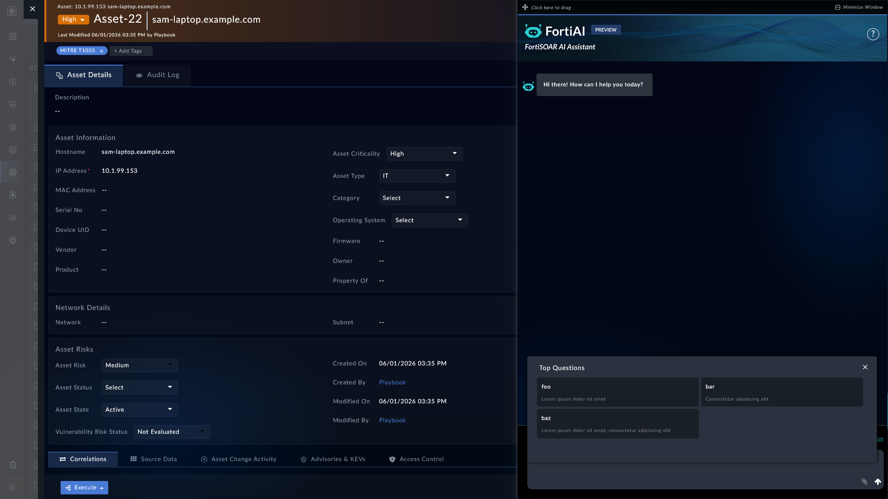

| [Home](../README.md) |
|----------------------|

# Advanced Usage

This section includes information that may be helpful to administrators and users interacting with OpenAI Assistant.

## Prompting tips

Simple tweaks to the input prompts could improve the playbook block generation process using **FortiAI**. While asking queries or giving input to the Assistant bot keep some tips in mind:

- To use a specific integration in a use case, provide it as part of the prompt. For example;

    - Use *Get IP Reputation using VirusTotal*

        instead of

    - *Get IP Reputation*.
    
    In the second prompt, FortiAI may include any enrichment source such as IP Quality Score, AlienVault-OTX, VirusTotal, etc. You must also ensure that any connector specified in the prompt is installed on your system.

- To create playbooks intended to add a record in FortiSOAR, avoid using *Create <`module name`> record* as the first step. Instead, place it in the next step after gathering details from a previous action.

    >For example, use *Fetch Unread Emails from Exchange and create Alert record*

- To update a record in FortiSOAR with some value, use *Update <`module name`>....*.

    >For example, *Update Alert Severity to Critical* works better than *Increase Alert Severity to Critical*. 

- To create playbooks with On Create, On Update, or On Delete triggers, add terms such as 'On create/on update/on delete of <`module name`> record, perform further <actions>...'.

    >For example, On Create of alert add a comment *Hello, Analyst!*

- To create playbooks with manual triggers, use 'Manual Trigger on <`module name`>, perform further <actions>...'

    >For example, Manually trigger a playbook upon a Phishing type Alert Record to change the status to Investigating.

- To create playbooks with manual inputs, add terms such as 'Prompt the user for further <`name some actions`>...'

    >For example, Check the reputation of the indicator using VirusTotal and prompt the user for action: either block it or take no action.

- To create playbooks with decision blocks, use If...else statements.

    >For example, Check the IP's reputation using VirusTotal. If it's considered malicious, set the indicator reputation as malicious. If it's considered suspicious, set the indicator reputation as suspicious. Otherwise, set the indicator reputation as good.

> [!Note]
> For more filtering prompts, refer to [Filtering Records](./prompts-for-filtering-records.md).

## Adding New modules to Preset Questions

This section details steps to add new modules and context-sensitive questions when that module's record is opened.

As an example, let us add the **Assets** module (Module API Name: `assets`) and related questions (say `foo`, `bar`, and `baz`) with *Lorem Text* as descriptions. For context, let's select `id`, `name`, and `description` as fields of interest.

1. Open the **Key Store** record named `fortiai-static-questions`

2. Click the **Edit Record** button to edit the record.

3. Enter the following JSON under the parent object `modules`:

```JSON
"assets": {
    "questions": [
    {
        "enabled": true,
        "question": "foo",
        "description": "Lorem ipsum dolor sit amet"
    },
    {
        "enabled": true,
        "question": "bar",
        "description": "Consectetur adipiscing elit"
    },
    {
        "enabled": true,
        "question": "baz",
        "description": "Lorem ipsum dolor sit amet, consectetur adipiscing elit"
    }
    ],
    "fieldsOfInterest": [
    "id",
    "name",
    "description"
    ]
}
```

Now when you open a record under **Assets** module, you can see the 3 questions `foo`, `bar`, and `baz` with *Lorem Text* as descriptions.



# Next Steps

| [Installation](./setup.md#installation) | [Configuration](./setup.md#configuration) | [Usage](./usage.md) | [Contents](./contents.md) |
| --------------------------------------- | ----------------------------------------- | ------------------- | ------------------------- |
