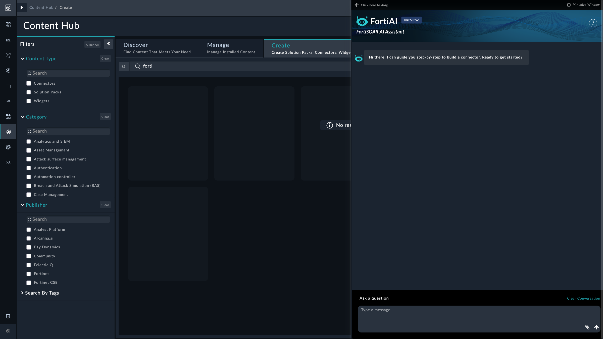

| [Home](../README.md) |
|---|

# Building a Connector Through Prompts

The following examples demonstrate how to use FortiAI to generate a FortiSOAR connector.

> [!Important]
>
> Connector generation currently does not support file attachments (PDF, Swagger specifications, Postman collections) when using the Fortinet FortiAI connector. This is a server-side limitation.
> As a workaround, you can provide API details inline, through chat, as `curl` commands or JSON request/response structures.


## Prerequisites

1. Navigate to **Automation** > **Connectors**, or to **Content Hub** > **Connectors**.
2. Click the **Create** tab, then click the **AI Assistant** icon to open the FortiAI panel.

   [](res/byoc_bot_dialog.png)

3. Enter a prompt that includes the connector's purpose, the actions it must perform, and the relevant API endpoint(s). API details can be provided as `curl` commands, JSON data, or file attachments in `.json`, `.yml`, `.txt`, or `.pdf` format.

---

## Example: Criminal IP Connector

This example creates a connector for Criminal IP using `curl` commands to provide API details.

1. Enter the following prompt:

   *Build a connector for the product Criminal IP with the following actions:*

   - *Get IP Reputation*
   - *Get Domain Reputation*

   ```
   curl --location --request GET "https://api.criminalip.io/v1/feature/ip/malicious-info?ip=8.8.8.8" \
     --header "x-api-key: <YOUR_API_KEY>"

   curl --location --request GET "https://api.criminalip.io/v1/domain/reports?query=example.com&offset=0" \
     --header "x-api-key: <YOUR_API_KEY>"
   ```

2. Press **Enter**. FortiAI analyzes the input, requests any missing details (such as the authorization type), and generates `info.json`, `operations.py`, and `connector.py`.

   At each stage, you can view individual files by entering a prompt such as *show `operations.py`*.

### Expected Outcome

After refreshing the page, the generated connector appears under the **Create** tab.

### Reviewing Results

Click **Edit** on the connector tile to review and modify the connector as needed.

### Publishing the Connector

Click **Publish** to make the connector available to all users. The connector then appears under the **Manage** tab in the Content Hub, and its associated sample playbooks are added to the Playbooks page.

---

## Example: WiGLE Connector

This example creates a connector for WiGLE using a JSON Swagger file attached to the prompt.

1. Enter the following prompt:

   *Build a connector for the product WiGLE with the following actions:*

   - *Get General Statistics*
   - *Get Country Statistics*
   - *Get Region Statistics*
   - *Get User Statistics*

   *Use the attached Swagger file `WiGLE.json` for API details.*

> [!TIP]
> For the full WiGLE API specification, refer to the [WiGLE Swagger API documentation](https://api.wigle.net/swagger).

2. Press **Enter** and follow the prompts. FortiAI analyzes the file, requests any missing details, and generates the connector files.

### Expected Outcome

After refreshing the page, the generated connector appears under the **Create** tab.

### Reviewing Results

Click **Edit** on the connector tile to review and modify the connector as needed.

### Publishing the Connector

Click **Publish** to make the connector available to all users. The connector appears under the **Manage** tab in the Content Hub, and its associated sample playbooks are added to the Playbooks page.

---

## Example: Logic Monitor Connector

This example creates a connector for Logic Monitor using structured text to define API operations.

1. Enter the following prompt:

   > *Build a connector for Logic Monitor using the following details:*
   >
   > **Operation**: Get Alert List
   > **Endpoint**: `/alert/alerts`
   > **HTTP Method**: GET
   > **Parameters**:
   > - **Fields** *(optional)*: Fields to exclude from the response.
   > - **Size** *(optional)*: Number of alerts to return. Default: `50`.
   > - **Offset** *(optional)*: Records to skip. Default: `0`.
   > - **Filter** *(optional)*: Filter query for alert types.
   >
   > **Operation**: Get Device Group List
   > **Endpoint**: `/device/groups`
   > **HTTP Method**: GET
   > **Parameters**:
   > - **Fields** *(optional)*: Fields to exclude from the response.
   > - **Size** *(optional)*: Number of device groups to return. Default: `50`.
   > - **Offset** *(optional)*: Records to skip. Default: `0`.
   > - **Filter** *(optional)*: Filter query for device groups.
   >
   > **Operation**: Get Device List
   > **Endpoint**: `/device/devices`
   > **HTTP Method**: GET
   > **Parameters**:
   > - **Fields** *(optional)*: Fields to exclude from the response.
   > - **Size** *(optional)*: Number of devices to return. Default: `50`.
   > - **Offset** *(optional)*: Records to skip. Default: `0`.
   > - **Filter** *(optional)*: Filter query.
   >
   > **Operation**: Get Device Alerts
   > **Endpoint**: `/device/devices/{id}/alerts`
   > **HTTP Method**: GET
   > **Parameters**:
   > - **ID** *(required)*: Device ID.
   > - **needMessage** *(optional)*
   > - **customColumns** *(optional)*
   > - **Fields** *(optional)*: Fields to exclude from the response.
   > - **Size** *(optional)*: Number of records to return. Default: `50`.
   > - **Offset** *(optional)*: Records to skip. Default: `0`.
   > - **Filter** *(optional)*: Filter query.
   >
   > **Operation**: Get Report List
   > **Endpoint**: `/report/reports`
   > **HTTP Method**: GET
   > **Parameters**:
   > - **Fields** *(optional)*: Fields to exclude from the response.
   > - **Size** *(optional)*: Number of records to return. Default: `50`.
   > - **Offset** *(optional)*: Records to skip. Default: `0`.
   > - **Filter** *(optional)*: Filter query.
   >
   > **Operation**: Get Report by ID
   > **Endpoint**: `/report/reports/{id}`
   > **HTTP Method**: GET
   > **Parameters**:
   > - **ID** *(required)*: Report ID.
   > - **Fields** *(optional)*: Fields to exclude from the response.

2. Press **Enter** and follow the prompts. FortiAI analyzes the input, requests any missing details, and generates the connector files.

### Expected Outcome

After refreshing the page, the generated connector appears under the **Create** tab.

### Reviewing Results

Click **Edit** on the connector tile to review and modify the connector as needed.

### Publishing the Connector

Click **Publish** to make the connector available to all users. The connector appears under the **Manage** tab in the Content Hub, and its associated sample playbooks are added to the Playbooks page.

---

## Next Steps

| [Installation](setup.md#installation) | [Configuration](setup.md#configuration) | [Usage](usage.md) | [Contents](contents.md) |
|---|---|---|---|
