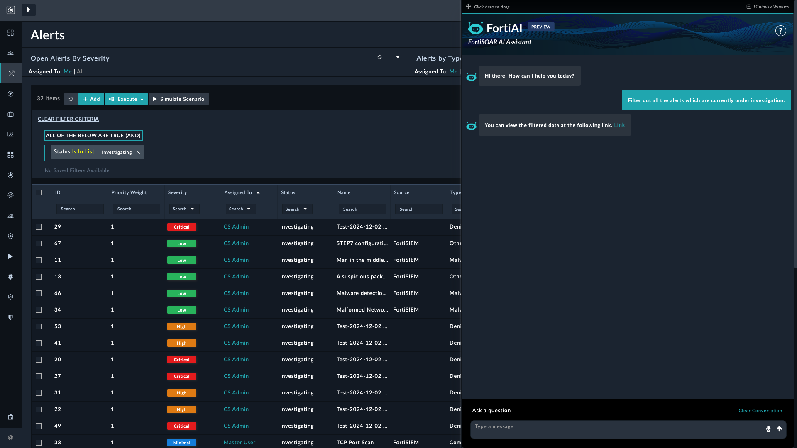
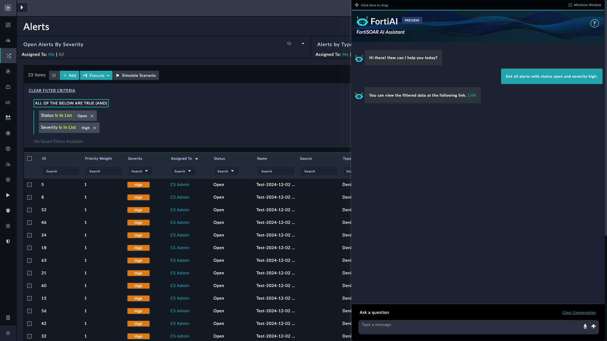
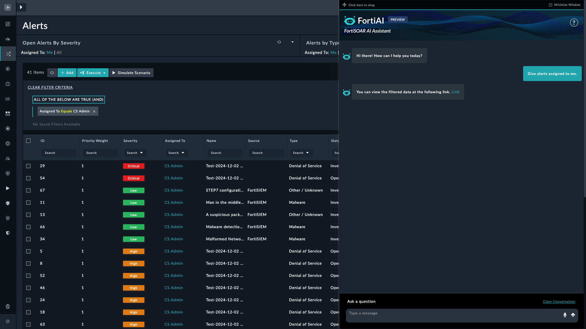
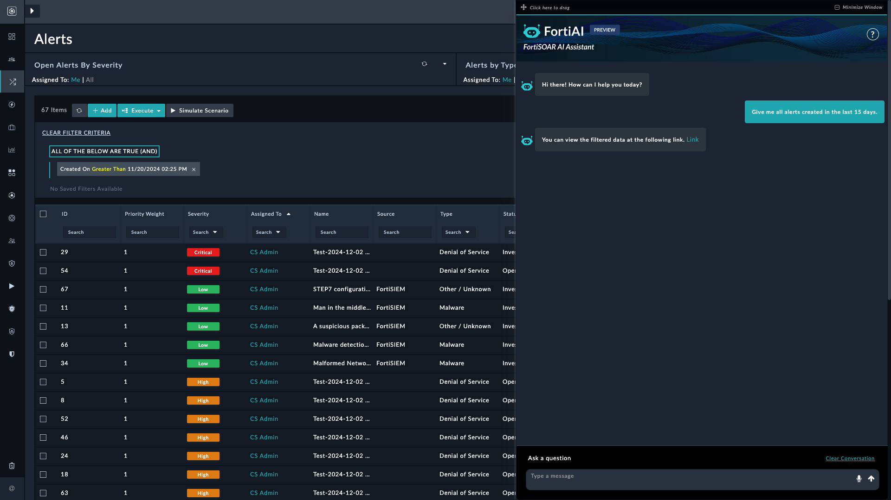

| [Home](../README.md) |
|----------------------|

# Filtering Alerts Through Prompts

This reference contains prompts for filtering alert records in FortiSOAR using the AI Assistant bot. Use these prompts to retrieve alerts based on criteria such as severity, status, date range, or assigned user.

> [!NOTE]
> Filtering operations apply to a single module at a time. Prompts that combine filter criteria across multiple modules (for example, alerts and cases simultaneously) are not supported.

---

## Example: Retrieve Alerts Under Investigation

Retrieves alerts whose **Status** is **Investigating**.

**Prompt:**
> *Filter out all the alerts which are currently under investigation.*

**Expected outcome:** Displays only alerts with a *Status* of **Investigating**.

Verify that the results include only alerts marked as **Investigating**.

---

## Example: Retrieve High-Severity Open Alerts

Retrieves alerts filtered by both severity and status.

**Prompt:**
> *Get all alerts with status open and severity high.*

**Expected outcome:** Displays only alerts with a *Status* of **Open** and a *Severity* of **High**.

Verify that only high-severity open alerts are returned.

---

## Example: Retrieve High-Severity Priority 1 Alerts

Retrieves alerts filtered by both severity and priority weight.

**Prompt:**
> *Give high-severity alerts with priority 1.*

**Expected outcome:** Displays only alerts with a *Priority Weight* of **1** and a *Severity* of **High**.

Verify that only alerts with priority weight 1 and high severity are returned.

---

## Example: Retrieve Alerts Assigned to the Current User

Retrieves alerts assigned to the currently logged-in user.

**Prompt:**
> *Give alerts assigned to me.*

**Expected outcome:** Displays only alerts assigned to the current user.

Verify that only alerts assigned to the current user are returned.

---

## Example: Retrieve Alerts Created Within a Date Range

Retrieves alerts created within a specified time period.

**Prompt:**
> *Give me all alerts created in the last 15 days.*

**Expected outcome:** Displays only alerts created within the last 15 days.

Verify that only alerts within the specified period are returned. For reliable DateTime filtering, always specify the year and timezone. See [DateTime filtering guidance](./troubleshooting.md#filters-involving-datetime) in the Troubleshooting guide.

---

## Additional Prompts

The following prompts can also be used to filter alert records:

1. *Give me alerts assigned to `[user name]`.*
2. *Give me all alerts created between October 1, 2024, and October 15, 2024.*
3. *Show me all alerts where the severity is either high or critical, the status is open or in progress, and the type is malware or phishing. The alerts should have been created within the last 7 days, and the source IP should start with `192.168.1`.*
4. *List all in-progress alerts, excluding those of the phishing or suspicious type.*
5. *Filter out all the alerts with technique ID `T1074.001`.*
6. *Find alerts triggered by the rule `PH_RULE_UEBA_AI_FILE_WRITTEN`.*

---

## Next Steps

| [Installation](./setup.md#installation) | [Configuration](./setup.md#configuration) | [Usage](./usage) | [Contents](./contents.md) |
|-----------------------------------------|-------------------------------------------|------------------|---------------------------|
