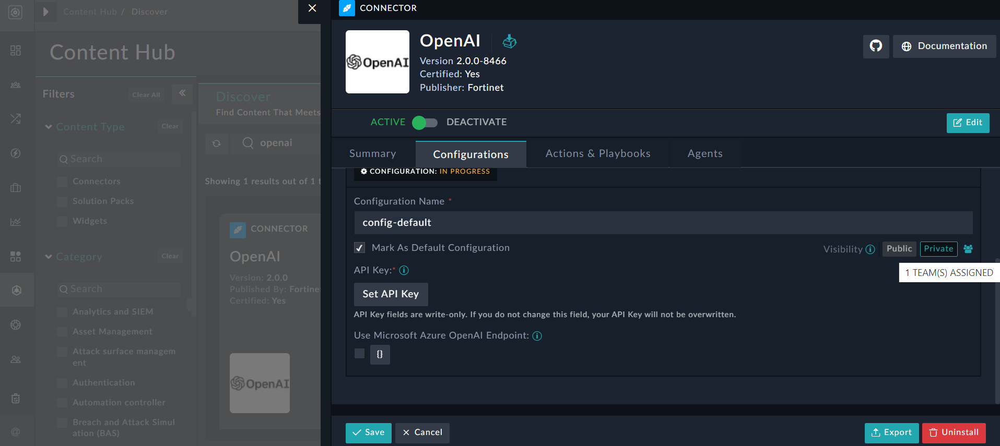
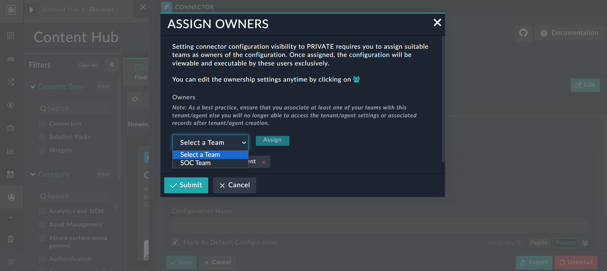

|[Home](../README.md) |
|--------------------------------------------|

# Installation

1. To install a solution pack, click **Content Hub** > **Discover**.
2. From the list of solution pack that appears, search **Fortinet Advisor**.
3. Click the **Fortinet Advisor** solution pack card.
4. Click **Install** on the lower part of the screen to begin the installation.

## Prerequisites

The **Fortinet Advisor** solution pack is not dependent on any other solution pack. However, it is recommended that you have purchased an OpenAI account and have a valid API key to access the OpenAI APIs. Also, ensure that the 'GPT4', i.e. the 'gpt-4-1106-preview' model is enabled for use in your OpenAI account. Versions prior of 'GPT4' do not generate correct responses. 

## Permissions

To utilize the Fortinet Advisor solution pack, uses must have the following permissions, along with other appropriate permissions:

- Read and Usage permissions on Widgets
- Read and Execute permissions on Playbooks

# Configuration

For optimal performance of the **Fortinet Advisor** solution pack, install and configure the following connectors and widget:

- The AI Assistant Utils connector that bundles helper methods, which aid with content generation. 

  >**NOTE**: The AI Assistant Utils connector comes pre-configured. For more details, see the [AI Assistant Utils Connector](https://docs.fortinet.com/document/fortisoar/1.0.0/ai-assistant-utils/690/ai-assistant-utils-v1-0-0) document.

- The AI Assistant widget that adds the Advisor bot to the FortiSOAR User Interface.

- The OpenAI connector as Fortinet Advisor uses OpenAI models as a backing LLM.  
    >**NOTE**: You must have OpenAI configured on your to get any response from Advisor. 

    - To configure and use the OpenAI connector, see the OpenAI connector document. Note that you must add a configuration for this connector. Also, in case of multiple configurations, ensure that you mark at least one configuration as 'Default', since the solution uses the connector configuration that is marked as 'Default'. For more details, see the [OpenAI Connector](https://docs.fortinet.com/document/fortisoar/2.0.0/openai/706/openai-v2-0-0) document. Also note that RBAC is not currently implemented for Fortinet Advisor; however you can restrict access by specifying the teams that are authorized to use the OpenAI connector.

To restrict access to Advisor by specifying the teams that are authorized to use the OpenAI connector, perform the following steps:

1. To limit access, open the OpenAI configuration, mark its **Visibility** as **Private**, and then click the **Ownership** icon:  
   
2. In the **Assign Owners** dialog, you will see that the logged-in user's teams are automatically assigned ownership. To remove ownership of any team, click the **Red Cross** beside its name; similarly, to assign ownership to any team, select the team from the **Owners** drop-down list, and then click **Assign**:  
     
   Once the teams are assigned, only those teams will have access to the OpenAI connector and will be able to receive responses from Fortinet Advisor.   
   Additionally, note that if you want to implement a specific configuration for a particular team, you must modify the default configuration for each OpenAI connector step in the Fortinet Advisor Solution Pack's playbooks. Another option is to update the Fortinet Advisor Solution Pack's playbooks to retrieve the configuration ID for a specific team or user, and then parse this ID in the OpenAI connector steps.

# Next Steps
| [Usage](./usage.md) | [Contents](./contents.md) |
|---------------------|---------------------------|