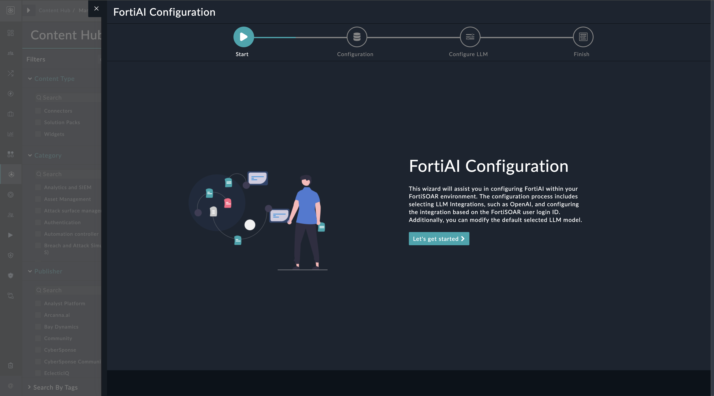
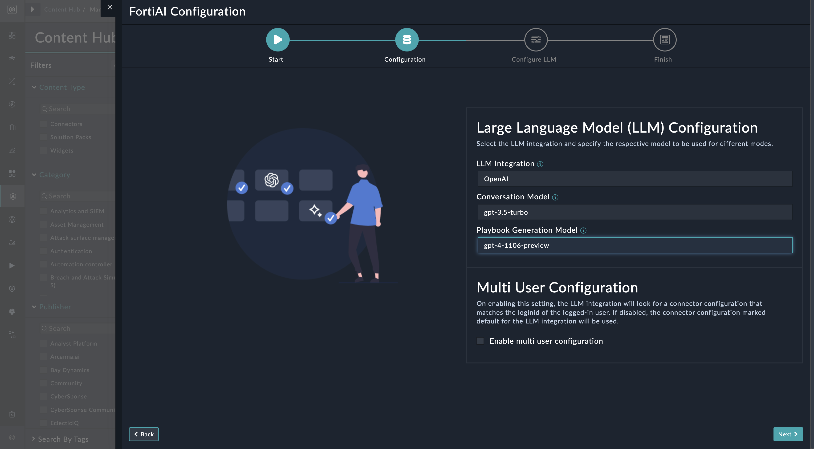
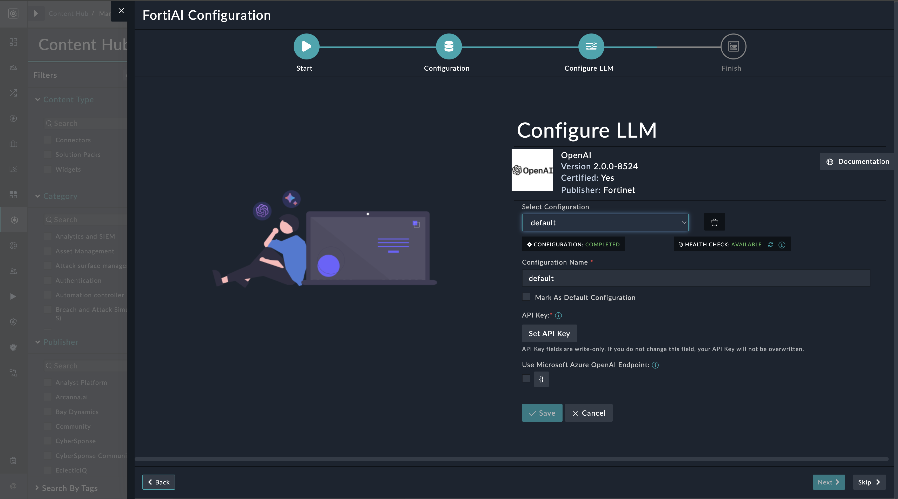

|[Home](../README.md) |
|--------------------------------------------|

# Installation

1. To install a solution pack, click **Content Hub** > **Discover**.
2. From the list of solution pack that appears, search **FortiAI**.
3. Click the **FortiAI** solution pack card.
4. Click **Install** on the lower part of the screen to begin the installation.

## Prerequisites

The **FortiAI** solution pack is not dependent on any other solution pack. However, it is recommended that you have purchased an OpenAI account and have a valid API key to access the OpenAI APIs. Also, ensure that the 'GPT4', i.e. the 'gpt-4-1106-preview' model is enabled for use in your OpenAI account. Versions prior of 'GPT4' do not generate correct responses. 

## Permissions

To utilize the FortiAI solution pack, uses must have the following permissions, along with other appropriate permissions:

- Read and Usage permissions on Widgets
- Read and Execute permissions on Playbooks

# Configuration

For optimal performance of the **FortiAI** solution pack, install and configure the following connectors and widget:

- The AI Assistant Utils connector that bundles helper methods, which aid with content generation. 

  >**NOTE**: The AI Assistant Utils connector comes pre-configured. For more details, see the [AI Assistant Utils Connector](https://docs.fortinet.com/document/fortisoar/1.0.0/ai-assistant-utils/690/ai-assistant-utils-v1-0-0) document.

- The AI Assistant widget that adds the Advisor bot to the FortiSOAR User Interface.

- The OpenAI connector as FortiAI uses OpenAI models as a backing LLM.  
    >**NOTE**: You must have OpenAI configured on your to get any response from Advisor. 

    - To configure and use the OpenAI connector, see the OpenAI connector document. Note that you must add a configuration for this connector. For more details, see the [OpenAI Connector](https://docs.fortinet.com/document/fortisoar/2.0.0/openai/706/openai-v2-0-0).

## Setup LLM Integration on FortiSOAR
After installation of **FortiAI** solution pack, run the configuration wizard to ready your FortiSOAR environment.

1. Log in to FortiSOAR and [after installation](#installation), click the button **Configure** from the lower-left of the screen.

    

2. Click the button **Let's get started** on the FortiAI configuration page.

    

3. Specify LLM Integration to use and related model for Conversation, Playbook Generation mode and click **Next**.

    

4. Click **Finish** to complete the configuration process.

    

# Next Steps
| [Usage](./usage.md) | [Contents](./contents.md) |
|---------------------|---------------------------|