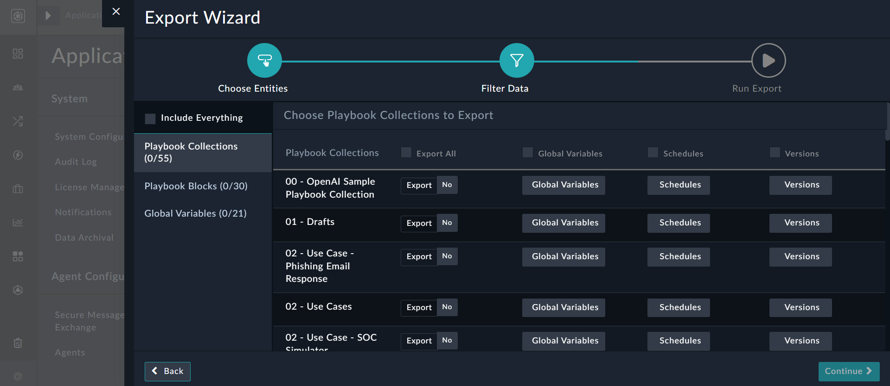
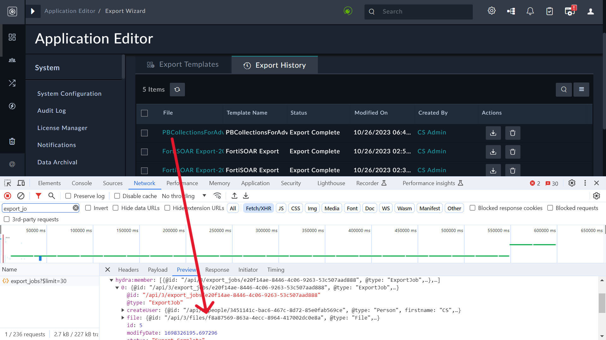
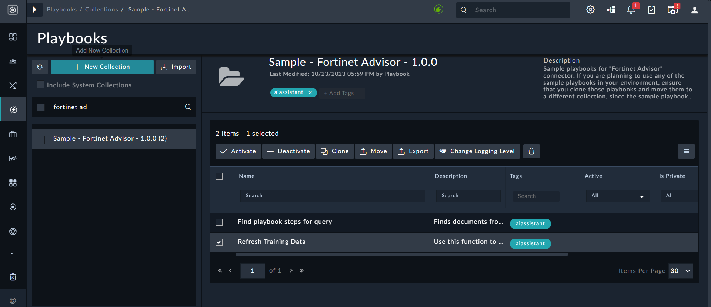
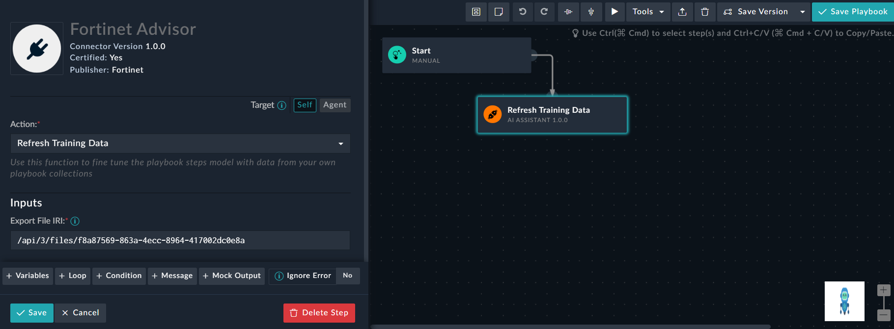

| [Home](../README.md) |
|--------------------------------------------|

# Usage

This section attempts to demonstrate how you can leverage Fortinet Advisor to generate playbooks, create response plans, understand Jinja, etc. It also provides steps on how to train the solution using your own playbook collection to get results that reflect your organization's context, and includes prompting tips that enable you to get better and more specific answers from Fortinet Advisor.

## Training the solution on your own playbook collection

Fortinet Advisor is trained by default on a large collection of use-cases available on the [FortiSOAR Content-Hub](https://fortisoar.contenthub.fortinet.com/list.html). 

At the same time, we understand that each organization follows its own style and naming convention in developing automation content. For the Advisor to start speaking your language while generating the playbook blocks, you can append your own playbook collection to its training set. Use the following steps to update the training: 

1. Log onto FortiSOAR.
2. Navigate to **Settings** > **Application Editor** > **Export Wizard**.
3. On the `Export Wizard` page, click **New Template** to create a template that contains playbook collections you want to add as part of the training:  
   
4. Select the playbook collections to be included for the training, provide an appropriate name for the export, and then click **Save and Run Export** to complete the export process. 
5. Download the exported file.  
   The exported file is the latest entry in the **Export History** tab. Capture its unique identifier as shown in the following image:  
   
6. Click **Automation** > **Playbooks** and search for `Fortinet Advisor`.
7. Open the 'Sample - Fortinet Advisor - 1.0.0' playbook collection and clone the 'Refresh Training Data' playbook:  
   
8. Open the 'Refresh Training Data' playbook and click the **Refresh Training Data** step. In the **Export File IRI** box, enter the file IRI to the value you had captured in step 5, and save the step and the playbook: 
   
9. Run the updated playbook.  
   Once this playbook is successfully executed, your selected custom playbook collections become part of the training dataset.

## Prompting tips

For generation of playbook blocks using Fortinet Advisor, small changes to the input prompts might generate better results. Following are some tips that you can use keep in mind while providing inputs to Advisor:

- To use a specific integration in a use-case, provide it as part of the prompt. For example, use “Get IP Reputation using VirusTotal” instead of just “Get IP Reputation”. In the case of the latter, Advisor will include any enrichment source such as IP Quality Score, AlienVault-OTX, or VirusTotal, etc.
- To create entities in FortiSOAR, append the "`FortiSOAR`" keyword. For example, use "Create Indicator Records in FortiSOAR" instead of "Create Indicator", as in the case of the latter Advisor might not be able to understand whether you intend to create a record in FortiSOAR,  or use a threat intel integration for creating Indicators.
- To update a record in FortiSOAR with some value, use "Update <module name>....". For example, "Update Alert Severity to Critical" works better than "Increase Alert Severity to Critical". 