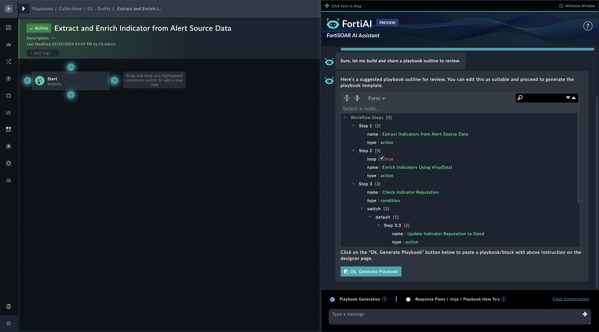
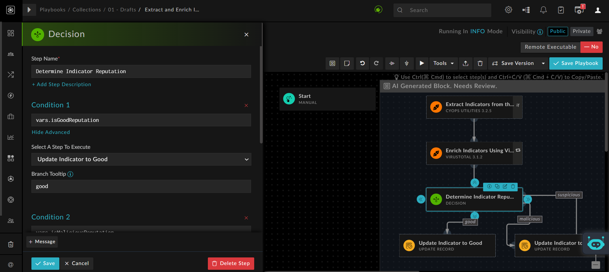
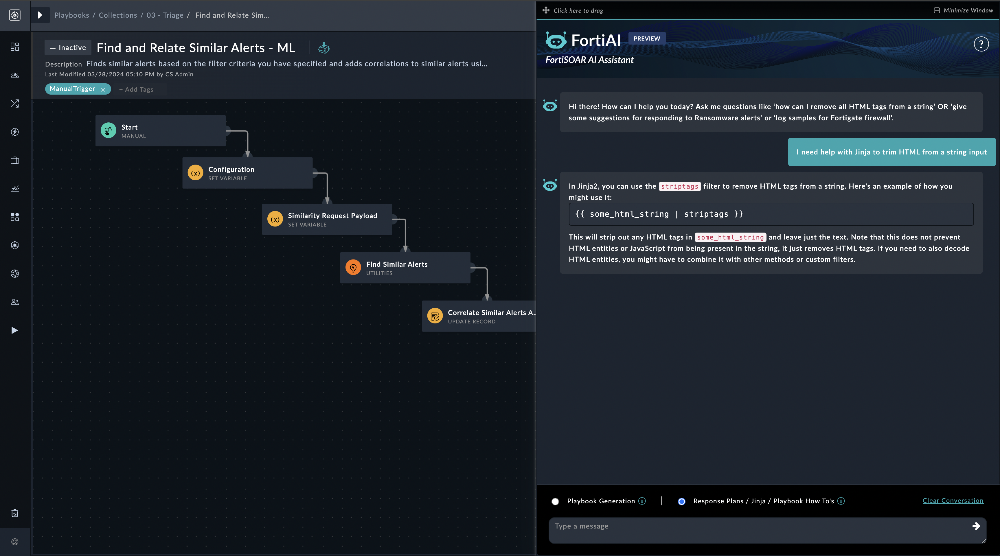
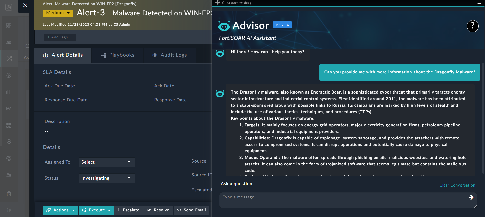
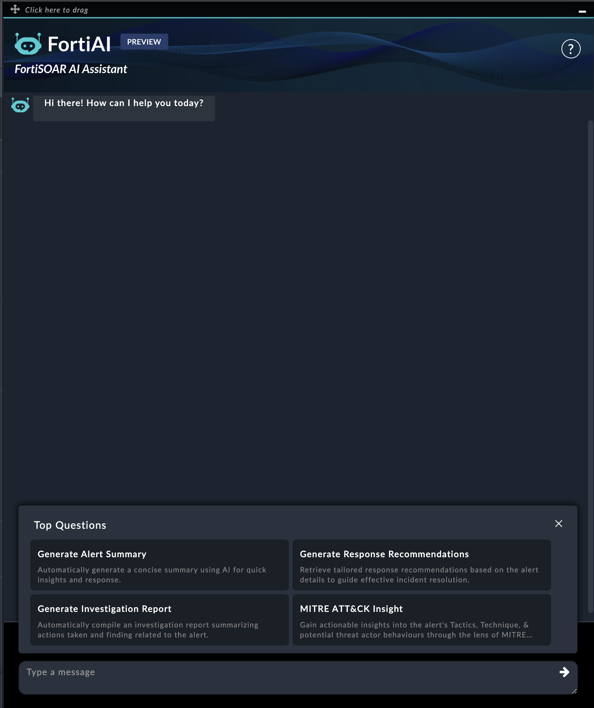

| [Home](../README.md) |
|---|

[TOC]

# Usage

The **FortiAI** solution pack supports the following operations via the AI Assistant bot:

| Operation | Description |
|---|---|
| **Create Connector** | Generate a connector from a natural language description and API specification. |
| **Generate Playbook** | Generate playbook steps or a complete playbook from a natural language description. |
| **Navigate Pages** | Navigate to a specific module or record. |
| **Link Record** | Correlate a record with another record (for example, link an indicator to an alert). |
| **Create Record** | Create a new record in a specified module. |
| **Update Record** | Update fields on an existing record. |
| **Filter Records** | Apply conditions to filter records within a module. |
| **Block Indicator** | Block an indicator using a configured connector. |
| **Enrich Indicator** | Retrieve the latest reputation for an indicator. |
| **Escalate to Case** | Escalate an alert to a case. |
| **Setup War Room** | Create a war room for a case. |
| **AI Investigation** | Run an automated AI-driven investigation from the Alert detail page. |

> [!NOTE]
> All operations listed above can also be triggered using the voice input feature.

---

## Generating a Connector

FortiAI can generate a FortiSOAR connector from natural language inputs and API specifications, producing all required connector files without manual coding.

### Procedure

1. **Provide input** — In the FortiAI interface, enter a prompt that specifies:
   - The purpose of the connector.
   - The actions it must perform.
   - The associated API endpoint(s).

   API details can be provided as:
   - `curl` commands
   - JSON request/response structures
   - File attachments in `.json`, `.yml`, `.txt`, or `.pdf` format (maximum 100 MB per file)

2. **Review generated files** — FortiAI generates the following standard connector files:
   - `info.json`
   - `connector.py`
   - `operations.py`
   - `requirements.txt` (generated only when code dependencies are present)

3. **Review import** — The generated files and associated sample playbooks are bundled and the connector is automatically imported into the **Create** tab of the Content Hub. Refresh the page to view the generated connector tile.

4. **Edit the connector** — Access the connector under the **Create** tab in the Content Hub and review or modify it using the BYOC tools.

### Best Practices

- Complete the full generation flow before making any modifications to the generated files.
- Provide clear and unambiguous API details. Well-structured inputs improve parameter extraction and output quality.

For step-by-step examples, see [Example: Building a connector](example-creating-connectors.md).

---

## Generating Playbooks

FortiAI generates playbooks and playbook steps from natural language descriptions entered in the Playbook Designer.

> [!TIP]
> Generate smaller, focused playbook blocks for easier review. Combine multiple blocks to build larger workflows.

### Procedure

1. **Open Playbook Designer** — For an introduction to the Playbook Designer, refer to [Creating Playbooks](https://docs.fortinet.com/document/fortisoar/8.0.0/user-guide/103864/get-started-with-fortisoar) in the FortiSOAR User Guide.

2. **Enter your requirements** — Type a natural language description in the Playbook Designer input field. For example:
   > *Extract Indicators from the Alert Source Data and enrich them using VirusTotal. Based upon reputation, if `malicious` update the indicator reputation to `malicious`, else if `suspicious` update the indicator reputation to `suspicious`, else update indicator reputation to `good`.*

3. **Modify the outline** — Adjust the generated playbook outline as needed. For example, replace one integration with another by editing the JSON. FortiAI tolerates minor typos in connector names.

   

4. **Generate the playbook** — Click **Ok, Generate Playbook**.

   > [!NOTE]
   > If a playbook step references a connector that is not installed, FortiAI will indicate which step requires the missing connector.

5. **Monitor progress** — A loading indicator is displayed while FortiAI generates the playbook steps.

6. **Review generated steps** — The generated playbook block appears in the Playbook Designer. Double-click any step to inspect its configuration.

   

7. **Connect to main flow** — Connect the generated playbook block to the main playbook flow to complete the workflow.

> [!TIP]
> Clear the conversation before switching to a different use case. This reduces token consumption and prevents context from one request influencing another.

For step-by-step examples, see [Example: Generating Playbooks](example-generating-playbooks.md).

---

## Navigating Pages

The AI Assistant bot can navigate to any module or record in FortiSOAR from a natural language command.

### Commands

- **Navigate to a module:**
  > *Navigate to the Alerts module*

  > *Navigate to Content Hub*

- **Open a specific record:**
  > *Open the record with ID [ALERT-ID]*

  The bot returns a hyperlink to the specified record. Previous conversation messages also retain navigation links.

---

## Providing Context

The bot automatically loads the context of the currently open record. You can ask questions about the open record directly without restating its details. For example:

> *What is the source IP in this record?*

> [!NOTE]
> Ensure the context is current and relevant when making decisions based on bot responses.

---

## Linking Records

The bot can correlate records with one another, such as linking an indicator to an alert or a case.

### Commands

- **Link a specific record:**
  > *Link indicator ID [INDICATOR-ID] to alert ID [ALERT-ID]*

- **Correlate records:**
  > *Correlate the newly detected IP [INDICATOR-ID] with [CASE-ID]*

> [!TIP]
> Verify that linked records are contextually relevant. Accurate links improve threat analysis and reduce noise.

---

## Creating Records

The bot can create new records in any FortiSOAR module.

> [!NOTE]
> For *Create Record* operations, the bot requires the `ID` and `UUID` of related records if they are not already present in the conversation history.

### Commands

- **Create a record:**
  > *Create a new case record in the Cases module*

- **Create with specific field values:**
  > *Create a new alert with the following details: [Details of the alert]*

  If required fields are missing, the bot will prompt for the missing information.

> [!NOTE]
> On an MSSP setup, users cannot prompt the bot from a master tenant to create a record on any tenant other than *`Self`*.

---

## Updating Records

The bot can update field values on existing records.

> [!NOTE]
> For *Update Record* operations, the bot requires the `ID` and `UUID` of the target record if not already in the conversation history.

### Commands

- **Update a record:**
  > *Update the case with ID [CASE-ID] with the following details: [Updated details]*

- **Update a specific field:**
  > *Update the alert status to "Resolved" and add a note: [Note text]*

> [!WARNING]
> Updating a record overwrites any existing value in the specified field.

---

## Filtering Records

The bot applies filter conditions to records in a module and returns a hyperlink to the filtered view.

### Commands

- **Filter by a single condition:**
  > *Filter alerts where severity is `high`*

- **Add additional conditions:**
  > *Add condition to show alerts created in the last 24 hours*

> [!NOTE]
> Filter conditions must target a single module at a time. Prompts that combine filter criteria across multiple modules (for example, cases and alerts simultaneously) are not supported.

For a complete reference of filtering prompts, see:
- [Prompts for filtering alert records](prompts-for-filtering-alert-records.md)
- [Prompts for filtering case records](prompts-for-filtering-case-records.md)
- [Prompts for filtering indicator records](prompts-for-filtering-indicator-records.md)

---

## Blocking Indicators

The bot triggers a playbook to block an indicator using a configured connector.

### Commands

- **Block by IP address:**
  > *Block IP address `[IP-ADDRESS]`*

- **Block by domain:**
  > *Block domain `[DOMAIN]` due to malicious activity*

  If the playbook execution takes time, the bot returns a link to the playbook execution log.

> [!NOTE]
> Verify that the connector used for blocking is correctly configured before issuing a block command.

---

## Enriching Indicators

The bot retrieves the current reputation for an indicator from configured threat intelligence sources.

### Commands

- **Enrich by IP address:**
  > *Retrieve the reputation of IP address `[IP-ADDRESS]`*

- **Enrich by domain:**
  > *Get the latest reputation for domain `[DOMAIN]`*

---

## Escalating an Alert to a Case

The bot triggers the alert escalation playbook, which collects required details (case name, severity) before creating the case.

### Commands

- **Escalate an alert:**
  > *Promote alert with ID [ALERT-ID] to a case*

- **Escalate with additional context:**
  > *Escalate alert [ALERT-ID] with subject [ALERT-SUBJECT] to a case*

> [!NOTE]
> If the alert record is open, the bot presents a manual input prompt. Pending manual inputs are also accessible under **Pending Tasks** in the FortiSOAR toolbar.

---

## Setting Up a War Room

The bot creates a war room associated with a specified case.

### Commands

- **Create a war room:**
  > *Establish a war room for case [CASE-ID]*

- **Create with context:**
  > *Create a war room for case [CASE-ID] involving [CASE-DESCRIPTION]*

> [!NOTE]
> If the case record is open, the bot presents a manual input prompt. Pending manual inputs are also accessible under **Pending Tasks** in the FortiSOAR toolbar.

> [!TIP]
> Keep the war room updated with the latest findings and ensure all relevant team members have access.

---

## Building Response Plans

The bot can generate a structured response plan framework for a security event, which can then be used as the basis for playbook creation.

### Commands

- **Request a response plan:**
  > *Can you help me with a plan to handle a phishing attack?*

  FortiAI returns a structured framework (for example: identify phishing emails, isolate affected systems, notify stakeholders). Use the **Playbook Generation** option to convert the framework into executable playbook steps.

> [!TIP]
> Review and update response plans regularly to reflect current threat intelligence and organizational requirements.

---

## Getting Help with Jinja Expressions

FortiAI can generate or explain Jinja expressions for use in playbooks.

### Commands

- **Request an expression:**
  > *Help me create a Jinja expression to extract the IP address from the alert data*

- **Request a specific field:**
  > *I need a Jinja expression to extract the field `source_ip` from the alert*

  

> [!TIP]
> Test Jinja expressions in a non-production playbook before deploying them.

---

## AI Investigation

**AI Investigation** is a tab on the **Alert** detail page. It runs an automated, agentic investigation of the alert using a coordinated set of AI agents — without requiring manual prompting.

### Running an Investigation

1. Open the alert you want to investigate.
2. Click the **AI Investigation** tab.
3. Click **Begin AI-Powered Alert Investigation**.

The investigation runs automatically. The left pane displays progress steps such as *Enriching Alert Context*, *Executing Investigation Plan*, *Evaluating Hypothesis*, and *Generating Investigation Verdict*.

### Investigation Output

After the investigation completes, the view displays three sections:

**AI Agents**
Lists the AI agents that participated in the investigation (for example, Alert Investigation Agent, Threat Intelligence Provider Agent).

**Hypotheses**
FortiAI generates five competing hypotheses for the alert, each representing a possible explanation for the observed activity:

| Classification | Description |
|---|---|
| Benign | Activity is expected and non-threatening. |
| False Positive | Alert was triggered incorrectly. |
| Malicious | Activity indicates a confirmed threat. |
| Suspicious | Activity warrants further investigation. |
| Inconclusive | Insufficient evidence to classify. |

Select a hypothesis to view its **Investigative Results**, **Hypothesis Details** (supporting and weakening factors, mapped MITRE ATT&CK tactics and techniques), and **Questions** (structured investigation questions with AI agent inputs and responses).

**Verdict**
Summarizes the overall alert classification. The Verdict section contains three tabs:

| Tab | Description |
|---|---|
| **Highlights** | Narrative summary of the triage process, including key supporting evidence and identified gaps. |
| **Key Findings** | Significant findings from the investigation. Select a finding to view additional detail. |
| **Next Steps** | Recommended actions for further investigation or response, for execution by the SOC analyst. |

Click **Re-investigate** to rerun the investigation after making changes such as updating configurations, adding threat intelligence sources, or modifying alert data.

> [!NOTE]
> AI Investigation results depend on the AI agents installed and configured in your environment. Users must have access to AI Agents, Widgets (Usage), Alerts, and Indicators. Refer to the individual AI agent documentation for prerequisites and configuration details.

---

## Contextual Questions

The AI Assistant bot maintains conversation context, loading the last 20 messages in the conversation window on login. Access the bot from any module list view or detail view, or via **AI** > **AI Agents** in the left navigation pane.

> [!NOTE]
> To change the message limit, edit the `messagesLimit` parameter in the `fortiai-configurations` **Key Store** record.

For example, with a Dragonfly malware alert open:

> *Can you provide me with more information about the Dragonfly Malware?*

---

## Module-Specific Preset Questions

When a record is open, the AI Assistant bot displays module-specific preset questions. Click a question to retrieve information about the open record.

For advanced usage, including prompting tips, see [Advanced Usage](advanced-usage.md).

---

## Next Steps

| [Installation](setup.md#installation) | [Configuration](setup.md#configuration) | [Contents](contents.md) |
|---------------------------------------|-----------------------------------------|-------------------------|
