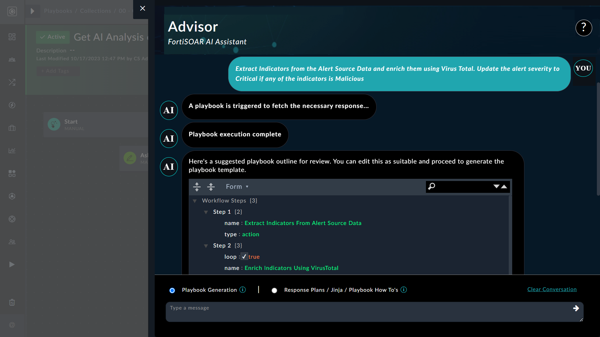
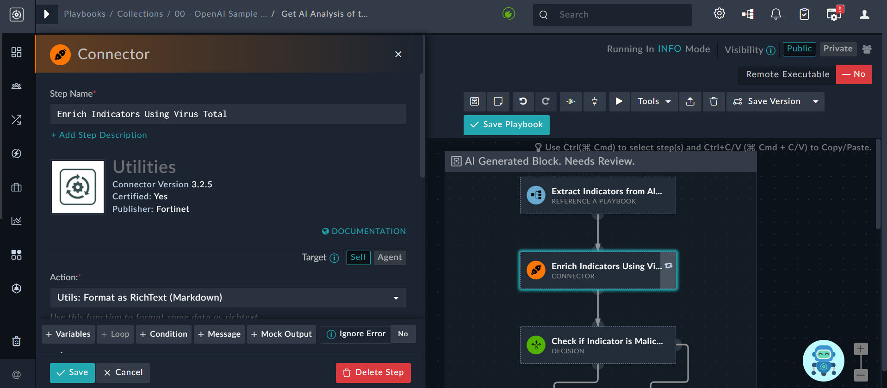

| [Home](../README.md) |
|----------------------|

# Usage

This section aims to demonstrate how you can leverage FortiAI to generate playbooks, create response plans, understand Jinja, and ask questions among other things. It also provides steps on how to train the solution using your playbook collection to get results that reflect your organization's context and includes prompting tips to help you receive better and more targeted responses from FortiAI.

FortiAI operates in two distinct modes &ndash; Playbook Blocks and Conversation Mode &ndash; to provide intelligent assistance and guidance to security professionals: 

- The **Playbook Blocks** mode is active in the playbook designer and provides users with two options
    - Playbook Generation
    - Response Plans / Jinja / Playbook How To's

- The Conversation mode is active in the list view and detail view of modules in FortiSOAR and provides users with the **Ask a question** option. 

<table>
    <tr>
        <th>EXAMPLE</th>
    </tr>
    <tr>
        <td>In the Conversation mode:
            <ul>
                <li>click the 'FortiAI' icon on the lower-right corner in the alert detail view.
                    

                </li>
                <li>Click the <strong>FortiAI</strong> to open the flyout to contextually communicate with the FortiAI
                    

                </li>
                <li>Click the <strong>Clear Conversation</strong> button to manually clear a conversation in FortiAI The <em>Clear Conversation</em> button clears the conversations only from the current Conversation mode and not from <strong>Playbook Generation Mode</strong>.</li>
            </ul>
        </td>
    </tr>
</table>

<table>
    <th>NOTE</th>
    <td>When a user logs out, all conversations are automatically cleared.</td>
</table>

## Use cases

### Build response plans using FortiAI

Consider a situation where you are assigned to create a plan of action for investigating a ransomware event.

You can use *FortiAI* to help with this task by opening a playbook in the playbook designer and clicking the **Response Plans / Jinja / Playbook How To's** option in the FortiAI flyout.

Type your query, such as

>*Can you help me with a plan to handle a phishing attack?*

Click the **Post** icon. FortiAI, in response, provides you with a good framework for a response plan that you can use to design playbooks utilizing the **Playbook Generation** option:  

### Get help with a Jinja expression

You might need assistance with Jinja expressions found in reference playbooks, or you might need specific Jinja values. For instance, you might be looking for a Jinja to trim HTML from a string input.

Use FortiAI to help with this task by clicking the **Response Plans / Jinja / Playbook How To's** option in the FortiAI flyout.

Typing your requirements, such as

>*I need help with Jinja to trim HTML from a string input*

Click the **Post** icon. FortiAI, in response, provides you with the relevant Jinja to utilize:

### Generate playbook steps using FortiAI

Assume for the moment that you are a playbook designer who is required to build workflows to mitigate various types of threats. 

  >**NOTE**: It is recommended to create smaller playbook blocks for easier review and minimal changes in the JSON template generated by FortiAI. You can then combine these small playbook blocks to create a larger playbook for your desired workflow.

One use case to mitigate threats could require playbook steps that that extract indicators from an alert and enrich them using a threat intelligence tool such as VirusTotal.

Based on the reputation, the indicator reputation is updated to *Malicious*, if the reputation returned by VirusTotal is *Suspicious*; or the indicator reputation is updated to *Good* if the reputation is anything but *Suspicious*.

You may not be a seasoned playbook developer yet and may require some assistance with developing this playbook.

Use FortiAI to help with this task by clicking the **Playbook Generation** option in the FortiAI flyout.

Type your requirements, such as

>*Extract Indicators from the Alert Source Data and enrich them using VirusTotal. Based upon reputation, If `malicious` update the indicator reputation to `malicious` else if `suspicious` update the indicator reputation to `suspicious` else update indicator reputation to good*

Click the **Post** icon. FortiAI, in response, designs the playbook and presents you with the proposed playbook outline:

In the review mode itself, you can make modifications, such as changing the integration from VirusTotal to IPStack. Once you are satisfied, click **Ok, Generate Playbook**:

<table>
    <th>NOTE</th>
    <td>If any step uses a connector that has not been installed, then FortiAI will display a message informing the user that the specific step requires a connector that is not installed on the system.</td>
</table>

Once FortiAI starts generating the playbook steps, a loader indicates the progress. After playbook steps have been generated, a playbook block is suggested in the playbook designer.

The FortiAI-generated playbook block may require review, which you can perform by clicking the playbook steps and examining each step. Following image shows the *Determine Indicator Reputation* step:

   

Post-review, you can connect the AI generated playbook blocks to the main playbook flow and create a complete workflow.

As  demonstrated, this represents a significant advancement in playbook design and is of enormous  assistance to individuals who are just starting out developing playbooks.

#### Common use cases for generating playbook steps using FortiAI

Some other playbook generation use cases that you could use to familiarize yourself with FortiAI are:

- Extract IOCs from CSV and Create Indicator Record for each
- Extract Indicators from Alert Source Data and Create Indicator Records for each
- Fetch Unread Emails from Exchange and create Alert record
- Notify using Slack when Alert severity changes
- On Create of alert add a comment *Hello, Analyst!*
- Check the IP's reputation using VirusTotal.
    - If it's considered malicious, set the indicator reputation as malicious.
    - If it's considered suspicious, set the indicator reputation as suspicious.
    - Else, set the indicator reputation as good
- Submit a file for analysis to FortiSandbox and obtain the verdict for the analysis job
- On Delete of alert, send an email to Admin
- Check the reputation of the indicator using VirusTotal and prompt the user for action: either block it or take no action
- Manually trigger a playbook upon a Phishing type Alert Record to change the status to Investigating

### Ask a contextual question to FortiAI

In **Conversation** Mode, FortiAI takes on a more interactive role, offering valuable assistance through conversations in a natural language. 

You can engage in contextual conversation with FortiAI in the list view and detail view of modules in FortiSOAR, where you can seek guidance, recommendations, information about the latest threats, security processes etc. FortiAI provides insightful responses, leveraging its extensive knowledge base.

In context of a malware (Dragonfly) alert, to know more about that malware, click the **FortiAI** icon in the alert detail view.

In the **Ask a question** text box, type

>*Can you provide me with more information about the Dragonfly Malware?*

Press **Enter** to get more information about the malware that is relevant to the alert in question, as shown in the following image:

  

FortiAI provides a summary about the malware and its associated threat groups. It also informs you that this malware has been observed in phishing campaigns and is designed to exploit vulnerabilities in common file formats, such as docx.

### Module Specific Question 

- Open any of the alerts and click on the bot icon. A few pre-defined questions will appear.

  

- Click on any of the questions, and a dialog box will appear to review the data that will be sent to the LLM.

  

For advanced usage topics, such as prompting tips n tricks, see [Advanced Usage](./advanced-usage.md).

| [Installation](./setup.md#installation) | [Configuration](./setup.md#configuration) | [Contents](./contents.md) |
|-----------------------------------------|-------------------------------------------|---------------------------|
