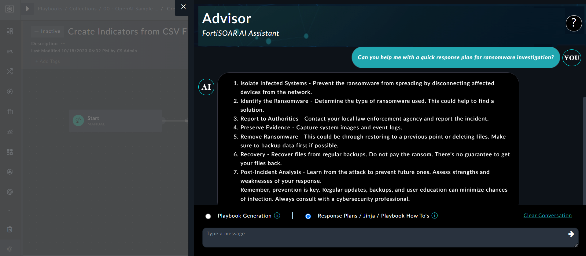
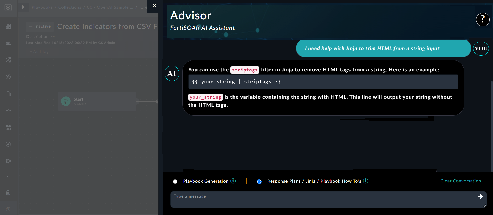

| [Home](../README.md) |
|--------------------------------------------|

# Usage

This section aims to demonstrate how you can leverage Fortinet Advisor to generate playbooks, create response plans, understand Jinja, etc. It also provides steps on how to train the solution using your own playbook collection to get results that reflect your organization's context and includes prompting tips to help you receive better and more targeted responses from Fortinet Advisor.

To get started, open a playbook in the playbook designer, and you will see the Fortinet Advisor (Advisor) button on the bottom right corner:    
   

Click Advisor to open the Advisor flyout where you can enter your queries to generate playbook blocks, or communicate with Advisor:  
   

## Use cases

### Build response plans using Advisor

Consider a situation where you are assigned to create a plan of action for investigating a ransomware event. You can use Advisor to help with this task by clicking the **Response Plans / Jinja / Playbook How To's** option in the Advisor flyout and typing your query, such as `Can you help me with a quick response plan for ransomware investigation?`, and clicking the **Post** icon. Advisor in response, provides you with a good framework for the response plan that you can use to design playbooks utilizing the **Playbook Generation** option:  
   

### Get help with Jinja expression

You might need assistance with Jinja expressions found in reference playbooks, or you might need specific Jinja values—for instance, Jinja for trimming HTML from a string input. Use Advisor to help with this task by clicking the **Response Plans / Jinja / Playbook How To's** option in the Advisor flyout and typing your requirements, such as `I need help with Jinja to trim HTML from a string input` and clicking the **Post** icon. Advisor in response, provides you with the relevant Jinja to utilize:  
   

Similarly, to gain confidence in building automation, you could also ask questions such as "Show me how to use the 'for' loop in playbooks".

### Generate playbooks using Advisor

Assume for the moment that you are a playbook designer who is required to build workflows to mitigate various types of threats. One use case of designing a playbook would be one that extracts indicators from an alert, enriches them using a threat intelligence tool such as VirusTotal, and updates the severity of the alert to 'Critical', if any of the extracted indicators are malicious. If you are not a seasoned playbook developer and require some assistance with developing this playbook, you can use Advisor to help with this task by clicking the **Playbook Generation** option in the Advisor flyout and typing your requirements, such as `Extract Indicators from the Alert Source Data and enrich them using Virus Total. Update the alert severity to Critical if any of the indicators is Malicious`, and clicking the **Post** icon. Advisor in response designs the playbook and presents you with the proposed playbook outline:  
   

In the review mode itself, you can make modifications, such as changing the integration from VirusTotal to, for example, IPStack, etc. Once you are satisfied, click **Generate Playbook**:  
   

Advisor generates playbook blocks that naturally require review, which you can do by clicking on the playbook steps and examining each of the steps, for example, the 'Enrich Indicators Using Virus Total' step shown in the following image:  
   

After reviewing, you can connect these steps to the start step of the playbook to create a good playbook. As  demonstrated, this represents a significant advancement in playbook design and is of enormous  assistance to individuals who are just starting out developing playbooks.

Some other playbook generation use cases that you could use to familiarize yourself with Advisor are:

- Create indicators from a CSV file
- Extract indicators/IOCs from an Alert
- Find the reputation of an indicator and enrich that indicator. Update the reputation of the indicator to Good or Malicious using detection
- Poll an email inbox to ingest emails
- Take an IP address input from the user and find the its reputation using VirusTotal. Add the reputation fetched from VirsTotal as a comment to the record
- Find the reputation of an indicator and take input from the user to block the indicator or do nothing
- Investigate an alert of type Phishing and provide AI analysis to remediate the attack
- Notify when alert severity is changed
- Send attachments to a sandbox
- Notify the analyst, SOC team, or external administrators about the alert severity and attack information. Methods of notification should include Email, Teams, and Slack.

## Utilizing your own playbook collections to train the solution

By default, Fortinet Advisor is trained using the large collection of use cases available on the [FortiSOAR Content Hub](https://fortisoar.contenthub.fortinet.com/list.html). 

Simultaneously, we recognize that every organization develops automated content according to its own style and naming practice. You can add your own playbook collections to the Advisor's training set to have it speak your language when creating the playbook blocks. Use the following steps to update the training using your playbook collections: 

1. Log onto FortiSOAR.
2. Navigate to **Settings** > **Application Editor** > **Export Wizard**.
3. On the `Export Wizard` page, click **New Template** to create a template that contains playbook collections you want to add as part of the training:  
   
4. Select the playbook collections to be included for the training, provide an appropriate name for the export, and then click **Save and Run Export** to complete the export process. 
5. Download the exported file.  
   The exported file is the latest entry in the **Export History** tab. Capture its unique identifier, as shown in the following image:  
   
6. Click **Automation** > **Playbooks** and search for `Fortinet Advisor`.
7. Open the 'Sample - Fortinet Advisor - 1.0.0' playbook collection and clone the 'Refresh Training Data' playbook:  
   
8. Open the 'Refresh Training Data' playbook and click the **Refresh Training Data** step. In the **Export File IRI** box, enter the file IRI to the value you had captured in step 5, and save the step and the playbook: 
   
9. Run the updated playbook.  
   Once this playbook is successfully executed, your selected custom playbook collections become part of the training dataset.

## Prompting tips

Simple tweaks to the input prompts could improve the playbook block generation process using Fortinet Advisor. While asking queries or giving input to Advisor keep the some tips in mind:

- To use a specific integration in a use case, provide it as part of the prompt. For example, use “Get IP Reputation using VirusTotal” instead of just “Get IP Reputation”. When it comes to the latter, Advisor will include any enrichment source such as IP Quality Score, AlienVault-OTX, or VirusTotal, etc.
- To create entities in FortiSOAR, add the "`FortiSOAR`" keyword. For example, use "Create Indicator Records in FortiSOAR" rather than "Create Indicator". If you use the latter option, Advisor might not be able to determine whether you want to create a record in FortiSOAR or use a threat intel integration for creating indicators.
- To update a record in FortiSOAR with some value, use "Update <module name>....". For example, "Update Alert Severity to Critical" works better than "Increase Alert Severity to Critical". 