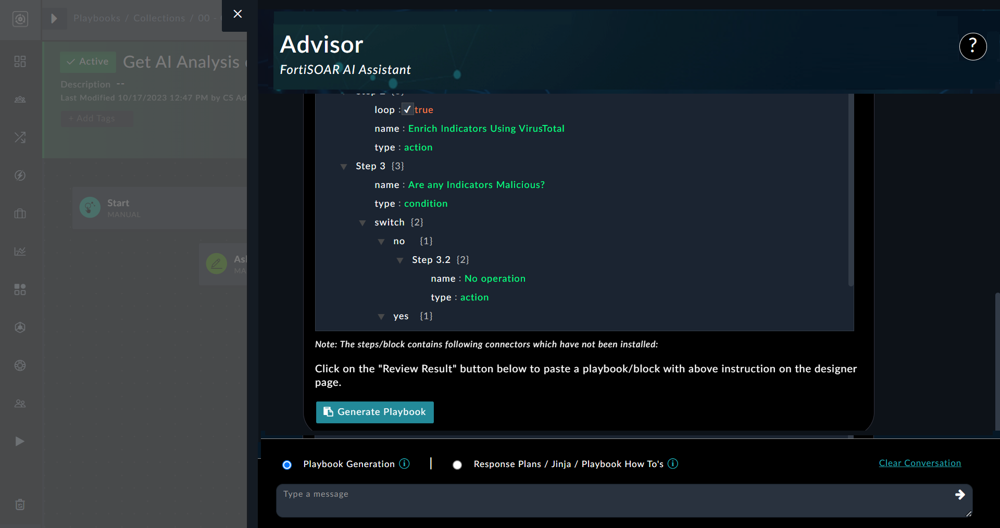

| [Home](../README.md) |
|--------------------------------------------|

# Usage

This section aims to demonstrate how you can leverage Fortinet Advisor to generate playbooks, create response plans, understand Jinja, ask questions, etc. It also provides steps on how to train the solution using your own playbook collection to get results that reflect your organization's context and includes prompting tips to help you receive better and more targeted responses from Fortinet Advisor.

Advisor operates in two distinct modes—Playbook Blocks and Conversation Mode—to provide intelligent assistance and guidance to security professionals: 

- The **Playbook Blocks** mode is active in the playbook designer and provides users with two options, **Playbook Generation** and **Response Plans / Jinja / Playbook How To's**.
- The Conversation mode is active in the list view and detail view of modules in FortiSOAR and provides users with the **Ask a question** option. 

For example, to get started in the Conversation mode, click the 'Advisor' icon on the lower-right corner in the alert detail view, as shown in the following image:  

Clicking the **Advisor** icon opens the Advisor flyout where you can communicate contextually with Advisor:  

To manually clear a conversation in Advisor, click the **Clear Conversation** button. Note, that Clear Conversation clears the conversation for that mode only, for example, if you are in the Conversation Mode, the conversation will be cleared for only this mode and not for the Playbook Generation mode.

  >**NOTE**: When a user logs out, all conversations are automatically cleared.

## Use cases

### Build response plans using Advisor

Consider a situation where you are assigned to create a plan of action for investigating a ransomware event. You can use Advisor to help with this task by opening a playbook in the playbook designer and clicking the **Response Plans / Jinja / Playbook How To's** option in the Advisor flyout and typing your query, such as `Can you help me with a plan to handle a phishing attack?` and clicking the **Post** icon. Advisor in response, provides you with a good framework for the response plan that you can use to design playbooks utilizing the **Playbook Generation** option:  
   

### Get help with Jinja expression

You might need assistance with Jinja expressions found in reference playbooks, or you might need specific Jinja values—for instance, Jinja for trimming HTML from a string input. Use Advisor to help with this task by clicking the **Response Plans / Jinja / Playbook How To's** option in the Advisor flyout and typing your requirements, such as `I need help with Jinja to trim HTML from a string input` and clicking the **Post** icon. Advisor in response, provides you with the relevant Jinja to utilize:  
   

### Generate playbook steps using Advisor

Assume for the moment that you are a playbook designer who is required to build workflows to mitigate various types of threats. 

  >**NOTE**: It is recommended to create smaller playbook blocks for easier review and minimal changes in the JSON template generated by Advisor. You can then combine these small playbook blocks to create a larger playbook for your desired workflow.

One use case to mitigate threats could require playbook steps that that extracts indicators from an alert, enriches them using a threat intelligence tool such as VirusTotal. Based on the reputation, the indicator reputation is updated to 'Malicious', if the reputation returned by VirusTotal is 'Suspicious', else the indicator reputation is updated to 'Good'. If you are not a seasoned playbook developer and require some assistance with developing this playbook, you can use Advisor to help with this task by clicking the **Playbook Generation** option in the Advisor flyout and typing your requirements, such as `Extract Indicators from the Alert Source Data and enrich them using VirusTotal. Based upon reputation, If malicious update the indicator reputation to malicious else if suspicious update the indicator reputation to suspicious else update indicator reputation to good`, and clicking the **Post** icon. Advisor in response designs the playbook and presents you with the proposed playbook outline:  

In the review mode itself, you can make modifications, such as changing the integration from VirusTotal to, for example, IPStack, etc. Once you are satisfied, click **Ok, Generate Playbook**:  

  >**NOTE**: If any step uses a connector that has not been installed, then Advisor will display a message informing the user that the specific step requires a connector that is not installed on the system. 

Once the process starts for generating the playbook steps, a loader guides how much of the process is completed. Once the process is complete, the playbook block is automatically pasted into the playbook designer. The Advisor-generated playbook block naturally require review, which you can do by clicking on the playbook steps and examining each of the steps, for example, the 'Determine Indicator Reputation' step shown in the following image:  
    
Post-review, you can connect the AI generated playbook blocks to the main playbook flow and create a complete workflow. 

As  demonstrated, this represents a significant advancement in playbook design and is of enormous  assistance to individuals who are just starting out developing playbooks.

#### List of other common use cases

Some other playbook generation use cases that you could use to familiarize yourself with Advisor are:

- Extract IOCs from CSV and Create Indicator Record for each
- Extract Indicators from Alert Source Data and Create Indicator Records for each
- Fetch Unread Emails from Exchange and create Alert record
- Notify using Slack when Alert severity changes
- On Create of alert add a comment "Hello, Analyst!"
- Check the IP's reputation using VirusTotal. If it's considered malicious, set the indicator reputation as malicious. If it's considered suspicious, set the indicator reputation as suspicious. Else, set the indicator reputation as good
- Submit a file for analysis to FortiSandbox and obtain the verdict for the analysis job
- On Delete of alert, send an email to Admin
- Check the reputation of the indicator using VirusTotal and prompt the user for action: either block it or take no action.
- Manually trigger a playbook upon a Phishing type Alert Record to change the status to Investigating.

### Ask a contextual question to Advisor

In Conversation Mode, Advisor takes on a more interactive role, offering valuable assistance through natural language conversations. 

You can engage in contextual conversation with Advisor in the list view and detail view of modules in FortiSOAR, where you can seek guidance, recommendations, information about the latest threats, security processes etc. Advisor provides insightful responses, leveraging its extensive knowledge base. For example, if you are in context of a malware (Dragonfly) alert, and you want to know more about that malware, click the **Advisor** icon in the alert detail view and in the **Ask a question** text box, type `Can you provide me with more information about the Dragonfly Malware?` and then press **Enter**:  
  

Advisor provides a summary about the malware and its associated threat groups. It also informs you that this malware has been observed in phishing campaigns and is designed to exploit vulnerabilities in common file formats, such as docx.

### Module Specific Question 

- Open any of the alerts and click on the bot icon. A few pre-defined questions will appear.
  
- Click on any of the questions, and a dialog box will appear to review the data that will be sent to the LLM.
  

For advanced usage topics, such as prompting tips n tricks, see [Advanced Usage](./advanced-usage.md).

| [Installation](./setup.md#installation) | [Configuration](./setup.md#configuration) | [Contents](./contents.md) |
|-----------------------------------------|-------------------------------------------|---------------------------|